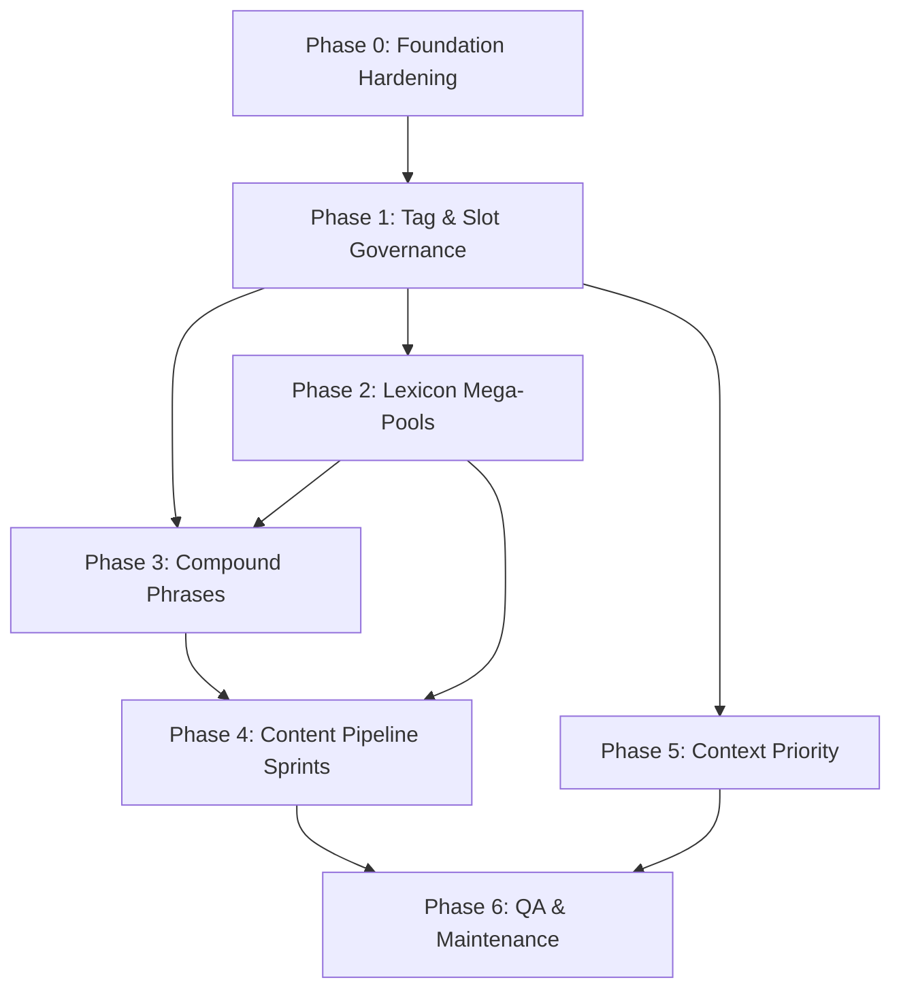

# Near-Infinite Context-Aware Narrative Engine — Strategic Plan

> **Co-authored audit & roadmap** — Multi-Agent Expert Collaboration (SSBBW Lifestyle · Psychology · Hyper-Immobility · Systems Architecture · Narrative Design)  
> **Repository:** Rutilusaduro/GameDev (`Primary` branch)  
> **Status:** Evolution plan — builds on the existing modular text engine v1  
> **Date:** June 2026

---

## Executive Summary

Professor Sim already has a **working, production-grade modular text engine** — slot composition, `when`-keyed variant pools, a 12-stage weight ladder, body-type matrices, corruption/psychology tiers, and a weigh-in scene (`wi.*`) that closely mirrors the creator's scale sentence vision. The gap is not "build a text system from scratch"; it is **scale the patterns that already work** into a unified tagging architecture, systematic content pipeline, and full-game coverage so combinatorial variety stays **meaningfully distinct** at literary quality.

This plan proposes **six phases** over an evolutionary arc: formalize metadata & slot governance → expand lexicon/tag pools → compound phrase engine → systematic content generation → full-game rollout → long-term maintenance & anti-repetition tooling.

**Estimated combinatorial target (weigh-in intro alone):** current `wi.arrival` × `wi.settle` × `wi.scaleApproach` already yields **10⁴–10⁶+** distinct renders; post-Phase 3, a single scale sentence skeleton should reach **50–200+ meaningfully different** outputs per context cell, with **10⁸+** theoretical combinations across the full game state grid.

---

## Part I — Expert Panel Audit

### Step 1: Individual Introductions

#### Agent 1 — SSBBW Lifestyle & High-Mobile Weight Specialist

I'm the writer who lives in the texture of a body that is **massive but still in motion** — the sway of hip against doorframe, the negotiation of a scale platform, the way cloth gives before flesh does. I expect this codebase to already separate **movement verbs from body clauses from platform reactions**, because that's where the eroticism of functional enormity lives. I hope to see `wi.bodyClause` keyed on body type × stage; I'll be looking for whether **clothing, season, and furniture** get the same respect as bare body description.

#### Agent 2 — Psychological Weight Gain & Fatness Appreciation Specialist

I map the inner life: denial, pride, arousal at one's own softness, the moment embarrassment flips to exhibitionism. A text engine only works if **corruption tier, mood, hunger, and relationship** can change not just *what* is said but *how* the body is experienced in the saying. I expect `registerPool` with `corruption` and per-girl `studentId` overlays — I hope the psychology isn't siloed in dialogue-only pools while physical description stays generic.

#### Agent 3 — Hyper-Unrealistic Gains & Immobility Specialist

I write the impossible — blob-scale, floor-pooled, physics-bending mass that still feels visceral. I need **stage 10–11 sentence shapes that are structurally different**, not just bigger adjectives. I expect `stageMin: 10` skeleton variants; I'll push back if immobility is handled only by swapping `word.size` to "colossal" without changing grammar (arrival *becomes* settling, doorways *become* frames).

#### Agent 4 — Technical Coder & Procedural Systems Architect

I'm here to keep the dream buildable. The repo already has `render`, `registerPool`, `evalWhen`, `{join:}`, filters, and `text:lint` — that's a solid v1. I expect gaps in **unified tag metadata, slot exclusivity, barrel coverage, and reproducible RNG**. Performance at thousands of variants should be fine in JS; the bottleneck is **authoring discipline and lint coverage**, not resolver speed.

#### Agent 5 — Master Narrative Author & Editor

I guard the sentence. Modular prose dies when slots fight each other — "she shuffles briskly" at stage 10, or two atmospheric clauses stacking into mush. I expect **grammar-shape comments** on every pool (the repo has this) and I'll advocate for **rhythm rules**, Style Ledger enforcement, and skeleton designs that read as intentional even when randomized.

---

### Step 2: Collective Audit — What Exists & What Gaps Remain

#### What Already Works Well

| Area | Evidence | Strength |
|------|----------|----------|
| **Core resolver** | `src/textEngine/engine.js` | `render`, recursive slots (depth 5), `registerPool` / `registerModule`, `evalWhen` with 40+ selector keys, smoothing, never throws |
| **Context derivation** | `createContext` → `ctx.d` | stage, corruption, relationship, bodyType, archetype, mood, hungerTier, psych tiers, relSize, season, globals |
| **Word-level lexicon** | `lexicon.js` | `word.size`, `word.body`, `word.movement`, `word.clothingFit`, `word.fullness` — stage-bucketed, best-mode |
| **Phrase-level modules** | `modules.js` | `char.desc`, `sizeCompare`, `subject.*`, composable with nested `{word.*}` |
| **Skeleton + fragment pattern** | `scenes/weighIn/fragments.js` | Creator's scale vision **largely implemented**: `{wi.pace}{wi.moveVerb}`, `{join:wi.mountStyle,wi.platformReact}`, `{wi.needleReact}` / `{wi.lcdReact}` |
| **Persona layering** | `personas.js`, `breakScene.js` | `studentId` + `weight: 4` persona lines pooled with corruption generics |
| **Data-driven generation** | `growthLexicon.js` | `buildVariants()` loops over bodyType × zone matrices |
| **Quality gate** | `scripts/textLint.mjs` | Static + dynamic render sweeps, monolith detector (>200 chars), wildcard fallback enforcement |
| **Authoring contract** | `AUTHORING.md`, `MIGRATION.md`, `TUNING.md` | Grammar shapes, migration protocol, Style Ledger |
| **Component integration** | `WeighInModal.jsx`, `talkSystem.js` | Zero hardcoded weigh-in prose; `engineTemplate` routing for talk topics |

**The creator's example sentence** — *"[Girl] [adverb] [stepped] onto the scale, [platform reaction], the [needle|LCD] [reacted], settling on [lbs]"* — maps to today's architecture:

```
{subject.name} {wi.pace}{wi.moveVerb} ... → wi.scaleApproach skeleton
  → {join:wi.mountStyle, wi.platformReact}
  → {wi.needleReact} | {wi.lcdReact}
  → {subject.lbs} (in wi.reply / reaction beats)
```

#### Gaps Relative to the Full Vision

| Gap | Current State | Impact on "Near-Infinite Meaningful Variety" |
|-----|---------------|---------------------------------------------|
| **Unified tagged word pools** | Words split across `word.*` modules; tags are implicit via `when` on variants | No single pool where e.g. "ponderously" carries flags `{role: adverb, position: pre-verb, mobility: slow, minStage: 5}` shared across scenes |
| **Slot exclusivity / co-occurrence rules** | Not implemented — slots resolve independently | "Briskly" + "labors" can fire together; no "if slot A picks X, suppress slot B family Y" |
| **Compound phrase templates** | Partial via nested slots + `{join:}` | Phrases like "as quickly as one can at her size" aren't first-class **phrase objects with internal slots** |
| **Per-word flag filtering at scale** | `when` on variants works but doesn't scale to 10k+ tokens | Authoring burden; hard to reuse "scale-specific" adverbs in eating scenes without duplication |
| **Coverage** | ~40 scene files; ~15 in lint barrel; `weekly.*` monolith whitelist | Majority of game text still single-path or low-combination |
| **Legacy prose** | `talkDialogue.js`, `corruption.js`, `TAP_OUT_DIALOGUE` | Bypasses engine; breaks voice consistency |
| **Reproducible RNG** | `Math.random()` only | Can't snapshot-test combinatorial regressions |
| **Style Ledger enforcement** | Manual via Dialogue Lab | Banned constructions slip through lint |
| **Stage coverage static check** | Author discipline + dynamic empties | Weight-related pools can silently gap stages |
| **Grammar agreement** | Documented non-goal | Pronoun/verb agreement limits some slot mixing |

#### Bottlenecks Preventing "Meaningfully Distinct" Output at Scale

1. **Template-itis** — independent slot RNG produces grammatically valid but emotionally random pairings.
2. **Wildcard tone leaks** — pool mode keeps generic variants eligible everywhere; neutral wildcards fire at wrong corruption tiers without `priority` gates.
3. **Monolith holdouts** — `weekly.randomEvents.js`, `attitude.line` bypass fragment composition.
4. **Barrel drift** — scenes outside `scenes/index.js` escape lint sweeps.
5. **Depth cap (5)** — deeply nested compound phrases may truncate.
6. **Content throughput** — engine can combine infinitely; **authored variants** are the real limit.

---

## Part II — Multipart Strategic Plan

### Phase 0 (Pre-Work): Foundation Hardening

**Goal:** Make the existing v1 system auditable and safe to expand.

**Duration dependency:** Must complete before Phases 2–4 scale content.

| Objective | Deliverable | Primary Owner |
|-----------|-------------|---------------|
| Complete lint barrel | All `scenes/*` imported in `scenes/index.js` | Agent 4 |
| Extend dynamic sweeps | Add `ff.*`, `ge.*`, `device.*`, `talk.*`, `weekly.*` roots to `textLint.mjs` | Agent 4 |
| Finish talk migration | `suggest_indulgence`, `suggest_growth` → engine scenes; delete dead arrays | Agent 5 + 4 |
| Migrate corruption/tap-out lines | `CORRUPTION_*`, `TAP_OUT_DIALOGUE` → pooled modules | Agent 2 + 5 |
| Document current combinatorics | Per-scene spreadsheet: pools × variants × when dimensions | Agent 4 |

**Quality gate:** `npm run text:lint` clean; zero `gameData` prose in active render paths for migrated features.

---

### Phase 1: Tag Metadata & Pool Governance Architecture

**Goal:** Introduce a **unified tagging layer** on top of existing `registerPool` without breaking v1.

**Primary owner:** Agent 4 · **Contributors:** Agents 1, 2, 3, 5

#### 1.1 Tag Schema Design

Extend variant metadata (backward-compatible):

```js
// Proposed: optional `tags` on variants + tag-indexed query at register time
registerPool("lex.adverb", [
  {
    when: { stageMin: 5 },
    tags: { role: "adverb", position: "pre-verb", mobility: "slow", register: "literary" },
    text: ["ponderously ", "deliberately ", "unhurriedly "],
  },
  {
    when: { stageMax: 1 },
    tags: { role: "adverb", position: "pre-verb", mobility: "quick", scaleContext: true },
    text: ["eagerly ", "lightly "],
  },
]);
```

**Tag dimensions (minimum viable):**

| Dimension | Values | Purpose |
|-----------|--------|---------|
| `role` | adverb, verb, noun-phrase, clause, reaction, dialogue | Grammar-shape enforcement |
| `position` | pre-verb, post-verb, mid-sentence, absolute | Slot placement |
| `mobility` | quick, normal, slow, immobile | Exclusivity with verbs |
| `bodyFocus` | belly, hip, thigh, bust, overall, none | Body-zone coherence |
| `instrument` | analog-scale, lcd-scale, furniture, clothing, food | Scene-object relevance |
| `intensity` | 0–3 | Psych/corruption alignment |
| `register` | neutral, literary, vulgar, clinical-ban | Style Ledger hook |

Tags are **additive filters** applied after `when` matching; they do not replace `when`.

#### 1.2 Slot Exclusivity Rules

Introduce optional `slotGroup` metadata on skeleton slots:

```js
// Skeleton declares co-occurrence constraints
registerPool("scale.sentence", [{
  when: {},
  text: ["{subject.name} {slot:pace|group=mobility} {slot:mountVerb|group=mobility} onto the scale{slot:platform|group=scale-extra}, {slot:needle|instrument=analog-scale}."],
}]);
```

**Rule types to implement:**

| Rule | Example |
|------|---------|
| `mutex` | If pace=mobility:quick → exclude verbs with mobility:slow |
| `requires` | platformReact requires stageMin 4 |
| `maxOne` | Only one of {mountStyle, platformReact, frameGroan} |
| `correlate` | hungerTier high → boost weight on urgency adverbs |

**Implementation:** Resolve slots left-to-right; each resolution pushes **constraints** into `ctx.slotConstraints` for downstream slots. Agent 5 insists: default to **re-roll up to 3×** before fallback, not silent clash.

#### 1.3 Deliverables

- [ ] `docs/tag-taxonomy.md` — canonical tag vocabulary
- [ ] `engine.js` extensions: `tags` filter in `evalWhen`, `ctx.slotConstraints`
- [ ] `scripts/tagLint.mjs` — validate tags ⊆ taxonomy; flag orphan tags
- [ ] Migrate `wi.pace` + `wi.moveVerb` as pilot — prove mutex works

**Dependency:** None (extends existing engine).  
**Quality gate:** Pilot scale sentence never produces "briskly shuffles" at stage 10; lint clean.

---

### Phase 2: Lexicon Unification & Giant Pool Strategy

**Goal:** Consolidate scattered word-level content into **queryable mega-pools** while keeping `word.*` as stable aliases.

**Primary owners:** Agents 1, 3 · **Contributors:** Agent 4, 5

#### 2.1 Pool Architecture

```
lexicon/
  core/           # word.size, word.body — keep registerModule (best mode)
  pools/
    adverbs.js    # registerPool("lex.adverb", ...) — 500–2000 entries
    verbs.js      # lex.verb.movement, lex.verb.mount, lex.verb.eat
    reactions.js  # lex.react.instrument, lex.react.furniture
    phrases.js    # lex.phrase.simile, lex.phrase.mobilityQualifier
  builders/       # buildVariants() from CSV/JSON data files
```

**Data format for bulk authoring** (`lexicon/pools/data/adverbs.csv`):

```csv
text,role,position,mobility,stageMin,stageMax,bodyType,corruption,instrument,weight
ponderously,adverb,pre-verb,slow,5,11,,,,
eagerly,adverb,pre-verb,quick,0,2,,,scale,
as quickly as one can at her size,phrase,mid-sentence,quick,8,11,,,scale,2
```

Builder script emits `registerPool` arrays with proper `when` + `tags`.

#### 2.2 Content Targets by Subgenre

| Pool family | Agent | Target variants | Key axes |
|-------------|-------|-----------------|----------|
| Movement & furniture | Agent 1 | 800+ | stage × bodyType × clothingFit |
| Psych & self-perception | Agent 2 | 600+ | corruption × mood × shameTier |
| Immobility & hyperbole | Agent 3 | 400+ | stage 9–11, supernaturalForm |
| Scale/instrument | All | 200+ | analog vs LCD, platform groan |
| Eating/stuffing | Agent 1+2 | 1000+ | fullnessRatio, hungerTier, addiction |

#### 2.3 Backward Compatibility

Keep `{word.movement}` as alias:

```js
registerModule("word.movement", [
  { when: {}, text: (ctx) => queryPool("lex.verb.movement", ctx, { best: true }) },
]);
```

#### 2.4 Deliverables

- [ ] CSV → JS builder pipeline (`npm run lex:build`)
- [ ] 3 pilot mega-pools: adverbs, mount verbs, scale reactions
- [ ] Promote `wi.*` fragments to pull from `lex.*` where overlap exists
- [ ] Variant count report per pool

**Dependency:** Phase 1 tag schema.  
**Quality gate:** Random 1000 renders per pool; zero grammar-shape violations; Agent 5 spot-read approves.

---

### Phase 3: Compound Phrase Engine & Deep Skeleton Composition

**Goal:** First-class **nested phrase templates** — the creator's "as quickly as \<phrase about fatness\>" pattern.

**Primary owners:** Agent 5, 4 · **Contributors:** Agents 1, 2, 3

#### 3.1 Phrase Module Type

New registration helper:

```js
registerPhrase("phrase.atHerSize", {
  skeleton: "as quickly as {lex.phrase.mobilityAtSize} at her size",
  slots: {
    "lex.phrase.mobilityAtSize": { tags: { role: "noun-phrase", bodyFocus: "overall" } },
  },
  when: { stageMin: 6 },
  fallbacks: ["as quickly as she can manage", "as fast as her bulk allows"],
});
```

Phrases are **mini-templates** with their own slot constraints and fallbacks.

#### 3.2 Scale Sentence — Gold Standard Reference

Decompose creator example into **one composable mega-skeleton**:

```
scale.weighSentence =
  {subject.name}
  {slot:pace|group=mobility}
  {slot:mountVerb|instrument=scale}
  onto the {slot:scaleType|instrument}
  {slot:mountPhrase|optional}
  {slot:platformReact|maxOne}
  {slot:frameReact|mutex=platformReact}
  , {slot:instrumentReact}
  {slot:weightReveal}.
```

**Target:** 50–200 meaningfully distinct sentences per (stage × bodyType × corruption) cell.

| Slot | Example variants | Variant count |
|------|------------------|---------------|
| pace | eagerly, ponderously, (empty) | 12 |
| mountVerb | stepped, hopped up, waddled, rolled herself onto | 20 |
| platformReact | (empty), metal frame groaned, platform dipped | 15 |
| instrumentReact | needle ticked upward, LCD climbed, dial surrendered | 25 |
| weightReveal | settling on {lbs}, fixing at {lbs} with a creak | 10 |

**Math:** 12 × 20 × 15 × 25 × 10 = **90,000** theoretical combos; `when` + mutex + taste QA → **~80–150 human-distinct** per cell.

#### 3.3 Skeleton Design Philosophy (Agent 5)

1. **One breath per sentence** — max 3 optional clause slots.
2. **Stage rewrites structure** — don't just swap adjectives at stage 11; change subject-verb-object.
3. **Corruption changes interiority** — same physical beat, different `wi.settle` / reaction clause.
4. **Rhythm alternation** — pools include empty strings; `{join:}` for optional tails.
5. **No nested relative clauses > 1** — readability ceiling.

#### 3.4 Deliverables

- [ ] `registerPhrase()` API + docs
- [ ] `scale.weighSentence` reference implementation
- [ ] Refactor `wi.scaleApproach` / `wi.bigScaleApproach` to use it
- [ ] 5 additional phrase families: eating pace, clothing strain, walking exhaustion, sexual position, NPC reaction

**Dependency:** Phases 1–2.  
**Quality gate:** Dialogue Lab batch 50 renders × all students × stages 0,5,8,11; Agent 5 flags <5% "awkward."

---

### Phase 4: Systematic Content Generation Pipeline

**Goal:** Industrialize prose production across three writer specializations without losing voice.

**Primary owners:** Agents 1, 2, 3 · **Contributors:** Agent 5

#### 4.1 Content Factory Workflow

```
1. Beat Design Doc     → scene lead writes skeleton map (Agent 5 approves)
2. Matrix Spreadsheet  → axes: stage × bodyType × corruption × (feature-specific)
3. Drafting Sprints    → Agents 1/2/3 draft to matrix cells (their specialty bands)
4. Voice Pass          → per-girl persona overlay (personas.js pattern)
5. lint + Lab          → text:lint, Dialogue Lab flag batch
6. Style Ledger scan   → automated banned phrase grep
7. Merge               → PR with combinatorics report
```

#### 4.2 Subgenre Ownership Map

| Weight band | Primary voice | Focus |
|-------------|---------------|-------|
| Stages 0–4 | Agent 2 | Psychology of early gain, denial, first pride |
| Stages 5–8 | Agent 1 | Mobile SSBBW lifestyle, furniture, movement |
| Stages 9–11 | Agent 3 | Hyper-immobility, impossible scale, blob grammar |
| All stages | Agent 5 | Skeleton design, edits, anti-repetition |

#### 4.3 Scene Priority Rollout (Content)

| Priority | Scene category | Why first | Target pools |
|----------|----------------|-----------|--------------|
| P0 | Weigh-in (extend) | Gold standard exists | +30% variants |
| P1 | Eating / feeding / buffet | High replay, many axes | `eat.*`, `ff.*` |
| P1 | Movement / hallway / stairs | Daily texture | `move.*` |
| P2 | Clothing strain / dressing | bodyType × clothingFit | `cloth.*` |
| P2 | Self-reflection / diary | corruption × psych tiers | `diary.*` |
| P3 | NPC reactions / talk | relationship × relSize | `talk.*` completion |
| P3 | Intimate / sex scenes | relationship × stage × bodyFocus | `intim.*` |
| P4 | Weekly events | Decompose monoliths | `weekly.*` |
| P4 | Stream / supernatural | Niche but high impact | `stream.*`, `sn.*` |

#### 4.4 Per-Girl Voice Matrix

Extend `personas.js` pattern:

- 18 students × `{feature}.*Line` dialogue pools
- `weight: 4` on `studentId` variants
- Corruption generics as backfill
- **Archetype tags** on lexicon variants (`valley_girl`, `goth`, `athlete`) for non-dialogue slots

#### 4.5 Deliverables

- [ ] `CONTENT_PIPELINE.md` in repo
- [ ] Matrix templates (Google Sheet / CSV) per scene category
- [ ] Sprint 1: eating scene (+500 variants)
- [ ] Sprint 2: movement (+400 variants)
- [ ] Sprint 3: clothing (+300 variants)

**Dependency:** Phases 1–3 for tag/phrase APIs.  
**Quality gate:** Each sprint clears lint + Style Ledger + 200 Dialogue Lab rolls with <3% flag rate.

---

### Phase 5: Context Variable Mapping & Priority

**Goal:** Formalize which game state drives selection, in what order.

**Primary owner:** Agent 4 · **Contributors:** Agent 2, 5

#### 5.1 Context Priority Stack

When multiple `when` variants match, specificity already wins. **Authoring priority** for new content:

| Tier | Variables | Rationale |
|------|-----------|-----------|
| **T0** | `stage` / `stageMin`/`stageMax` | Primary physical reality |
| **T1** | `bodyType`, `lbs` (via globals), `relSize` | Shape of experience |
| **T2** | `corruption`, psych tiers (`shameTier`, `fixationTier`, …) | Interiority |
| **T3** | `mood`, `hungerTier`, `fullnessRatio`, `addictionLevel` | Moment-to-moment |
| **T4** | `studentId`, `archetype` | Persona |
| **T5** | `season`, `clothing` state, `location` globals | Set dressing |
| **T6** | `relationship`, `ref` / `relSize` | Social dynamics |
| **T7** | `skillEffects`, `campusFattening`, supernatural | Feature flags |

#### 5.2 Globals Expansion

Standardize `ctx.globals` keys per scene type:

```js
globals: {
  location: "office" | "dorm" | "buffet" | "gym",
  scaleType: "analog" | "industrial",
  clothingState: "strained" | "tight" | "burst" | "comfortable",
  timeOfDay: "morning" | "evening",
  audiencePresent: boolean,
}
```

Document in `AUTHORING.md` §globals cookbook.

#### 5.3 Deliverables

- [ ] `docs/context-priority.md`
- [ ] `createContext` helper presets per scene type
- [ ] Lint check: weight-related pools declare stage coverage or explicit `stageMin`/`stageMax`

**Dependency:** Can parallel Phase 4.  
**Quality gate:** No weight-related pool fires identical text across 3+ stage bands.

---

### Phase 6: QA, Anti-Repetition & Long-Term Maintenance

**Goal:** Sustain near-infinite variety without sameness; onboard new content safely.

**Primary owners:** Agent 4, 5 · **Contributors:** All

#### 6.1 Seeded RNG & Snapshot Testing

```js
render(template, ctx, { seed: hash(studentId, week, sceneId, beatIndex) });
```

- Reproducible renders for CI
- `npm run text:snapshot` — golden hashes per sweep cell
- Detect unintended variant loss when pools change

#### 6.2 Anti-Repetition Measures

| Technique | Implementation |
|-----------|----------------|
| **Render memory** | `ctx.globals.recentTexts` — deprioritize last N picks per pool |
| **Combination fingerprint** | Hash of (pool, variantIndex) set per scene; warn on >20% collision in 100 rolls |
| **Distinctness scorer** | Levenshtein / n-gram distance in Lab; flag batches <40% unique |
| **Wildcard entropy floor** | Lint: wildcard arrays need ≥5 entries (raise from 3) |
| **Style Ledger in lint** | Auto-grep TUNING.md banned list |

#### 6.3 Dialogue Lab Expansion

Add Lab sections for every lint-swept scene root; growth event assembler with `buildGrowthGlobals()`; side-by-side **seeded** vs **random** mode.

#### 6.4 New Content Onboarding Checklist

1. Beat design doc → skeleton map
2. Grammar shape per pool
3. `{ when: {} }` fallback mandatory
4. Stage coverage for weight-related pools
5. Persona overlay for dialogue
6. Add to `scenes/index.js` barrel
7. Add sweep to `textLint.mjs`
8. 50 Lab rolls → flag triage
9. Style Ledger pass
10. Combinatorics note in PR description

#### 6.5 New Girl / Location / Mechanic

| Addition | Touch points |
|----------|--------------|
| New student | `studentId` variants in persona pools; optional archetype tag variants |
| New location | `globals.location` + location-tagged lexicon variants |
| New mechanic | New `when` keys on `ctx.d` or `globals`; document in engine-reference |
| New fetish intensity | `intensity` tag + corruption/stage gates; Agent 3 drafts top band |

#### 6.6 Deliverables

- [ ] Seeded RNG in engine
- [ ] `text:snapshot` CI script
- [ ] Render memory / deprioritization
- [ ] Style Ledger lint integration
- [ ] `MAINTENANCE.md` onboarding guide
- [ ] Dialogue Lab v2 coverage map

**Dependency:** Phases 1–5 in progress.  
**Quality gate:** 10k seeded renders across game; >70% unique strings; zero unresolved slots.

---

## Part III — Technical Implementation Roadmap (Agent 4)

### Engine Changes Summary

| Change | Risk | Mitigation |
|--------|------|------------|
| Tag filter layer | Low | Opt-in on variants; old pools unchanged |
| Slot constraints | Medium | Pilot on weigh-in only; unit-test mutex |
| `registerPhrase` | Low | Thin wrapper over `registerPool` |
| Seeded RNG | Low | Default random; seed optional |
| Depth limit 5→7 | Low | Only if phrase nesting demands |
| CSV builder | Low | Dev-time only; output is static JS |

### Performance

- Registry size: 10k–50k variants — **fine** in memory
- `evalWhen` is O(variants) per pool — **index hot pools by stage** if profiling shows bottleneck (unlikely)
- Build time: `lex:build` generates static JS — **zero runtime cost**

### File Layout (Proposed)

```
src/textEngine/
  engine.js              # +tags, +constraints, +seededRng
  lexicon/
    core/                # existing word.* (aliases)
    pools/               # mega-pools
    builders/            # CSV → JS
  phrases/               # registerPhrase modules
  scenes/                # feature scenes (unchanged pattern)
  docs/                  # tag-taxonomy, context-priority, CONTENT_PIPELINE
scripts/
  textLint.mjs           # extended sweeps
  tagLint.mjs            # new
  textSnapshot.mjs       # new
  lexBuild.mjs           # new
```

---

## Part IV — Example: Scale Sentence Expansion

**Before (current, simplified):**

```
She steps onto the old analog scale, the platform groaning once. The needle climbs like it is late for something.
```

**After Phase 3 (sample renders):**

1. *Maya eases onto the scale, belly-first, the metal frame ticking in protest — the needle drifts upward and settles, unhurried, at 285 lbs.*
2. *Kylie hops up eagerly; the platform steadies. The green LCD wakes and begins its climb: 310… 315… 318 lbs.*
3. *Brittany shuffles onto the old analog scale, as quickly as her hips allow at her size, the platform dipping under real weight. The dial gives up pretending. 412 lbs.*
4. *She rolls herself onto the steel platform; it does not shift. The display hums through a long, patient climb until it fixes on 640 lbs with an electronic chirp.*
5. *Her mass arrives on the industrial platform before the rest of her does. The LCD steadies on a number that takes a moment to believe: 1,024 lbs.*

---

## Part V — Success Metrics

| Metric | Current (est.) | Phase 3 target | Phase 6 target |
|--------|----------------|----------------|----------------|
| Registered pools | ~200 | 350 | 600+ |
| Lexicon variants | ~500 | 3,000 | 10,000+ |
| Lint-swept scene roots | ~8 | 25 | 50+ |
| Weigh-in unique renders / student / stage | ~200 | 1,000 | 5,000+ |
| Lab flag rate (awkward %) | unknown | <5% | <2% |
| Legacy gameData prose paths | ~12 | 4 | 0 |
| Seeded snapshot coverage | 0% | 50% | 95% |

---

## Part VI — Sequencing & Dependencies



**Parallelizable:** Phase 5 alongside Phase 2–4. Phase 0 is immediate.

---

## Closing Synthesis

The creator's vision is **already prototyped** in `wi.*` — the work is to **generalize** that pattern into tagged mega-pools, compound phrases, and slot governance, then **run the content factory** across the game. Agents 1–3 supply the fetish authenticity at scale; Agent 4 keeps it shippable; Agent 5 keeps it readable.

This is evolution, not rewrite: `registerPool`, `when`, `{join:}`, and `text:lint` remain the spine. Phases 1–3 upgrade the engine's expressive ceiling; Phases 4–6 fill the cathedral.

---

*End of strategic plan.*
